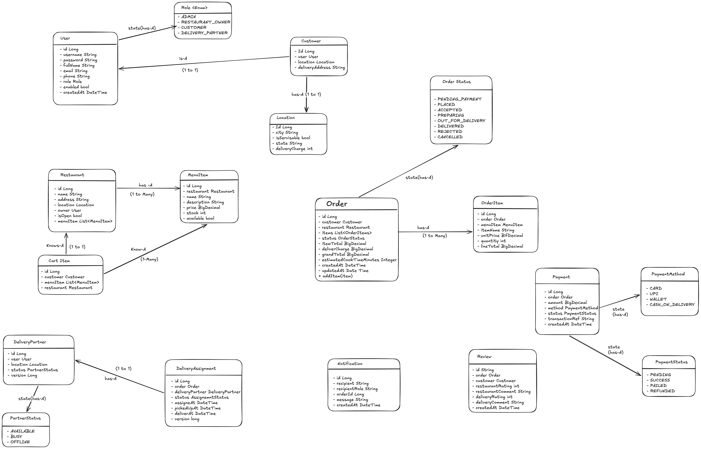

Flow
order place -> accepted -> preoaring -> out-for-delivery -> delivered

- Restaurant management Service = > manages inventory, restaurants, menu's,
- order management Service => manages order cycle
- Payment management Service =>
- Delivery management Service => delivery partner assignment
- Customer management Service =>

Controller layer -> dto layer -> service layer -> exception layer -> entity layer -> repository layer

Functional Requirements
1) customer browses based on location and menu adn restaurant
2) customer selects menu in a restaurant adds to cart and checks out 
3) deliver charges are charged based on the location of the restaurant
4) customer chooses payment option and pays for the ordered item
5) Concurrent orders for the same menu item should not oversell limited stock, 
6) Once payment is done Restaurant receive's the order and we start assigning a delivery partner 
7) Restaurant provides estimated time to cook the food to the delivery agent 
8) Delivery partner accepts to deliver the order and and partner assignment should
   handle multiple partners contending for the same order. 
9) customer sees delivery partner assigned on app 
10) Delivery partner picks up and delivers to customer 
11) Order Completed
12) Status updates should fan out asynchronously to customer, restaurant, and 
    delivery partner without blocking the calling flow. 
13) Ratings and reviews after delivery should be supported.

Entities Involved
- User 
- Customer 
- Delivery Partner 
- Location 
- Restaurant 
- MenuItem 
- CartItem 
- Order 
- OrderItem  
- Payment 
- DeliveryAssignment 
- Review 
- Notification  

