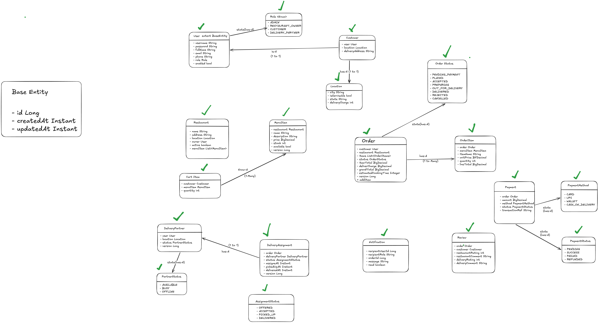

Flow
order place -> accepted -> preoaring -> out-for-delivery -> delivered


- Restaurant management Service = > manages inventory, restaurants, menu's,
- order management Service => manages order cycle
- Payment management Service =>
- Delivery management Service => delivery partner assignment
- Customer management Service =>


Controller layer -> dto layer -> service layer -> exception layer -> entity layer -> repository layer


Functional Requirements
1) customer browses based on location and menu adn restaurant
2) customer selects menu in a restaurant adds to cart and checks out 
3) deliver charges are charged based on the location of the restaurant
4) customer chooses payment option and pays for the ordered item
5) Concurrent orders for the same menu item should not oversell limited stock, 
6) Once payment is done Restaurant receive's the order and we start assigning a delivery partner 
7) Restaurant provides estimated time to cook the food to the delivery agent 
8) Delivery partner accepts to deliver the order and and partner assignment should
   handle multiple partners contending for the same order. 
9) customer sees delivery partner assigned on app 
10) Delivery partner picks up and delivers to customer 
11) Order Completed
12) Status updates should fan out asynchronously to customer, restaurant, and 
    delivery partner without blocking the calling flow. 
13) Ratings and reviews after delivery should be supported.


Entities Involved
- User -
- Customer 
- Delivery Partner -
- Location -
- Restaurant -
- MenuItem -
- CartItem 
- Order -
- OrderItem -
- Payment -
- DeliveryAssignment -  
- Review -
- Notification -


Enitity Observation


As createdAt and UpdatedAt fields are repetetive we can create a common baseClass for these fields instead of defining it many times

## Tech stack & why

| Choice | Reason |
| --- | --- |
| **Java 21** | LTS; records (immutable DTOs), pattern matching, modern language ergonomics. |
| **Spring Boot 3.5.15** | Mature ecosystem for REST + JPA + Security + events; latest 3.5 LTS line. Officially supports Gradle 8.x and Java 21 (Gradle 9 needs Boot 4.x), so the wrapper is pinned to **Gradle 8.14.3**. |
| **Spring Data JPA (Hibernate)** | Declarative persistence; lets me express the **atomic conditional stock decrement** and the **atomic assignment claim** as repository queries. |
| **Spring Security (HTTP Basic)** | Simple, role-based access control without pulling in OAuth/SSO (explicitly out of scope). |
| **Spring `ApplicationEventPublisher` + `@Async`** | Async status fan-out (observer pattern) without adding external infra like Kafka — keeps "no distributed systems" in scope. |
| **H2 (in-memory)** | Self-contained: `git clone` → `./gradlew bootRun`, no external DB to install. The code is standard JPA, so swapping to Postgres is a config change. |
| **Lombok** | Removes getter/setter/constructor boilerplate on entities and services. |
| **JUnit 5 + Spring Boot Test + MockMvc** | Unit tests for pure logic; integration tests for the concurrent and end-to-end flows. |
| **springdoc-openapi (Swagger UI)** | Auto-generated, role-aware interactive API docs with an HTTP Basic "Authorize" flow — no hand-written docs to drift. |
| **Docker (multi-stage)** | One-command setup with no local JDK/Gradle: build stage compiles the boot jar, runtime stage runs a slim JRE as non-root. |

## How to run

Prerequisites: JDK 21 on the path. Everything else (Gradle, dependencies) is downloaded by the wrapper.

```bash
# run the app (seeds demo data on first start)
./gradlew bootRun

# run all tests
./gradlew test

# build a runnable jar
./gradlew bootJar && java -jar build/libs/food-delivery-0.0.1-SNAPSHOT.jar
```

The API is served at `http://localhost:8080`. The H2 web console is at `http://localhost:8080/h2-console` (JDBC URL `jdbc:h2:mem:fooddelivery`, user `sa`, empty password).

## Run with Docker

No JDK needed locally — only Docker. The image is built in two stages (Gradle/JDK 21 builds the boot jar, then a slim JRE 21 runs it as a non-root user).

```bash
# Build the image and start the app (foreground)
docker compose up --build

# …or run detached and follow logs
docker compose up --build -d
docker compose logs -f app

# Stop and remove the container
docker compose down
```

Or with plain Docker:

```bash
docker build -t food-delivery:latest .
docker run --rm -p 8080:8080 food-delivery:latest
```

The app listens on `http://localhost:8080` with the same seeded demo data and credentials. Because persistence is in-memory H2, all data resets when the container stops — that's intentional for a self-contained demo.

## API docs (Swagger / OpenAPI)

Interactive, role-aware API docs are generated by springdoc-openapi:

- **Swagger UI:** `http://localhost:8080/swagger-ui.html`
- **OpenAPI JSON:** `http://localhost:8080/v3/api-docs`

Both paths are open (no auth) so the docs are always browsable. Endpoints themselves still enforce RBAC.

How to use it:

1. Open Swagger UI and click **Authorize** (top right).
2. Enter a seeded username/password — HTTP Basic (e.g. `customer1` / `customer123`).
3. Operations are grouped by feature **tag**, and every operation summary is prefixed with the role(s) allowed to call it — e.g. `[CUSTOMER]`, `[OWNER]`, `[PARTNER]`, `[ADMIN]`, `[ANY]`, `[PUBLIC]`. Calling an endpoint your role can't access returns `403`.

So to exercise the system as a given role, authorize as that user and use the matching operations (e.g. authorize as `owner1` to accept/prepare orders, as `partner1` to claim/pick up/deliver).

## Demo data & credentials

On first start (`DataSeeder`, skipped under the `test` profile) the app seeds:

- Locations: **Bengaluru** (delivery charge ₹40), **Mumbai** (₹55)
- A restaurant **"Spice Hub"** in Bengaluru with 3 menu items
- One user per role. All passwords as below (demo only):

| Role | Username | Password |
| --- | --- | --- |
| Admin | `admin` | `admin123` |
| Restaurant owner | `owner1` | `owner123` |
| Customer | `customer1` | `customer123` |
| Delivery partner | `partner1` | `partner123` |

Authentication is **HTTP Basic** — send `-u username:password` with each request.

## Architecture

Organised **package-by-feature** (`location`, `restaurant`, `menu`, `browse`, `customer`, `order`, `payment`, `delivery`, `review`, `notification`, `user`, `auth`) with cross-cutting concerns under `common`, `config`, `security`. Each feature follows a strict layering:

```
Controller            ->  Service                       ->  Repository
(HTTP <-> DTO records)    (transactions + business rules)   (JPA + atomic SQL)
```

**SOLID in practice**

- **SRP** — controllers only translate HTTP↔DTO; services own business rules and transactions; repositories own persistence. The order transition rules live in the `OrderStatus` enum, separate from the `OrderService` that applies them.
- **OCP** — order states/edges are *data* in the enum, so adding a transition doesn't touch transition callers; a new payment method is a new `PaymentProcessor` bean (resolved via `PaymentProcessorRegistry`) with no edits elsewhere; a new notification channel is a new listener.
- **LSP/ISP** — small, focused repository interfaces; DTOs are immutable `record`s.
- **DIP** — services depend on repository abstractions and `ApplicationEventPublisher`, not concrete infrastructure. Cross-module reactions (delivery, refunds, notifications) are wired through **domain events**, so e.g. the order module has no compile-time dependency on the delivery or payment modules.

**Design patterns used**

- **State machine** — `OrderStatus` holds the legal transition graph; `OrderService.applyTransition` enforces it.
- **Strategy + registry** — `PaymentProcessor` per `PaymentMethod`, selected at runtime by `PaymentProcessorRegistry`.
- **Observer (event-driven)** — status changes publish events; listeners fan out notifications, kick off delivery assignment, and issue refunds, all decoupled.
- **Repository** — Spring Data JPA.
- **DTO / immutable records** — request/response boundaries.

## Domain model

- `User` (ADMIN | RESTAURANT_OWNER | CUSTOMER | DELIVERY_PARTNER)
- `Location` 1───* `Restaurant` 1───* `MenuItem` (`price`, `stockQuantity`, `@Version`)
- `Customer` 1───* `Order` ───1 `Restaurant`
- `Order` 1───* `OrderItem` ───* `MenuItem` (snapshots name & unit price at order time)
- `Order` 1───1 `Payment` (amount, method, status)
- `Order` 1───1 `DeliveryAssignment` ───* `DeliveryPartner` (a User)
- `Order` 1───1 `Review` (food rating, delivery rating, comments)
- `Notification` ───* recipient `User`

Key modelling decisions:

- **A common `BaseEntity`** carries `id`, `createdAt`, `updatedAt` (JPA auditing) so timestamp columns aren't repeated on every entity.
- **Order items snapshot** the item name and unit price, so later menu/price edits never rewrite historical orders.
- **Money is `BigDecimal`** everywhere.
- **Optimistic locking (`@Version`)** on `MenuItem`, `Order`, `DeliveryPartner`, `DeliveryAssignment` guards against lost updates.
- **A cart maps to a single restaurant** (enforced when adding items), so a checkout yields exactly one order against one restaurant.

## Order & delivery state machine

```
PENDING_PAYMENT --pay--> PLACED --accept--> ACCEPTED --prepare--> PREPARING --pickup--> OUT_FOR_DELIVERY --deliver--> DELIVERED
       |                   |  \--reject--> REJECTED
       \--cancel-----------+--cancel--> CANCELLED
```

- `PENDING_PAYMENT`, `PLACED`, `ACCEPTED` may be **cancelled** by the customer (stock is returned, any captured payment refunded).
- `PLACED` may be **rejected** by the restaurant (same compensation).
- Delivery assignment lifecycle: `OFFERED --accept--> ACCEPTED --pickup--> PICKED_UP --deliver--> DELIVERED`.

## How the hard requirements are met

**1. Atomic order placement (stock + order state + payment).**
`OrderService.checkout` runs in one transaction: it snapshots each line, reserves stock, computes totals (delivery charge taken from the restaurant's location), and persists the order as `PENDING_PAYMENT`. If any line can't be reserved, the whole transaction rolls back — no partial reservation. Payment then settles the order to `PLACED` in a single transaction (`PaymentService.pay`).

**2. No overselling under concurrency.**
Stock is reserved with a **conditional atomic update**:

```sql
UPDATE menu_items SET stock_quantity = stock_quantity - :qty
WHERE id = :id AND available = true AND stock_quantity >= :qty
```

The `stock_quantity >= :qty` predicate is evaluated by the database under a row lock, so two concurrent orders for the last unit cannot both succeed. A `0`-row result becomes a `409 Conflict`. Verified by `StockConcurrencyIntegrationTest` (40 buyers race for 8 units → exactly 8 succeed, stock ends at 0).

**3. Delivery-partner assignment contention.**
When a restaurant accepts an order, one `OFFERED` assignment is created. Many partners may try to accept it; acceptance is a conditional atomic claim:

```sql
UPDATE delivery_assignments SET delivery_partner_id = :partner, status = 'ACCEPTED', assigned_at = :now
WHERE id = :id AND status = 'OFFERED'
```

Exactly one writer wins; the rest get a clean `409`. Verified by `DeliveryContentionIntegrationTest` (25 partners contend → exactly 1 wins).

**4. Restaurant relays estimated cook time.**
`POST /api/orders/{id}/accept` takes `estimatedCookTimeMinutes`, stored on the order and surfaced to the assigned partner via notification and on the order resource.

**5. Async, non-blocking status fan-out.**
Every status change publishes an `OrderEvent`. A `@TransactionalEventListener(AFTER_COMMIT)` + `@Async` listener writes notifications for the customer, restaurant, and delivery partner on a dedicated thread pool — so notification delivery never blocks (or can roll back) the order flow. Delivery-assignment kickoff and payment refunds are wired the same decoupled way.

**6. Ratings & reviews after delivery.**
`POST /api/orders/{id}/review` is allowed only for the owning customer once the order is `DELIVERED`, with separate food and delivery ratings (1–5). One review per order.

## Roles & access control

| Role | Can do |
| --- | --- |
| **ADMIN** | Manage locations/cities, create restaurants and assign owners, provision staff users. |
| **RESTAURANT_OWNER** | Manage own restaurant's menu & stock, accept/reject/prepare orders. |
| **CUSTOMER** | Browse, manage cart, checkout, pay, track, cancel, review. |
| **DELIVERY_PARTNER** | Set availability, view/accept offers, pick up and deliver. |

Enforced with Spring Security URL rules plus method-level `@PreAuthorize`. Cross-entity ownership (e.g. "you can only pay for / review your own order", "you can only manage your own restaurant") is checked inside the services.

## API reference

Base URL `http://localhost:8080`. All endpoints require HTTP Basic auth except registration and health.

### Auth & users
| Method | Path | Role | Purpose |
| --- | --- | --- | --- |
| POST | `/api/auth/register/customer` | public | Register customer (+profile) |
| POST | `/api/auth/register/delivery-partner` | public | Register delivery partner (+profile) |
| POST | `/api/users` | ADMIN | Create staff user (e.g. RESTAURANT_OWNER) |
| GET | `/api/users/me` | any | Current user |

### Locations (cities)
| Method | Path | Role |
| --- | --- | --- |
| POST | `/api/locations` | ADMIN |
| PUT | `/api/locations/{id}` | ADMIN |
| GET | `/api/locations`, `/api/locations/{id}`, `/api/locations/serviceable` | any |

### Restaurants & menu
| Method | Path | Role |
| --- | --- | --- |
| POST | `/api/restaurants` | ADMIN |
| POST | `/api/restaurants/{id}/active?value=` | ADMIN, OWNER |
| GET | `/api/restaurants`, `/api/restaurants/{id}` | any |
| GET | `/api/restaurants/mine` | OWNER |
| POST | `/api/restaurants/{id}/menu-items` | OWNER |
| PUT | `/api/menu-items/{itemId}` | OWNER |
| POST | `/api/menu-items/{itemId}/stock` | OWNER |
| GET | `/api/restaurants/{id}/menu-items` | any |

### Browse (customer discovery)
| Method | Path | Role |
| --- | --- | --- |
| GET | `/api/browse/locations` | any |
| GET | `/api/browse/restaurants?locationId=` | any |
| GET | `/api/browse/restaurants/{id}/menu` | any |

### Cart
| Method | Path | Role |
| --- | --- | --- |
| GET | `/api/cart` | CUSTOMER |
| POST | `/api/cart/items` | CUSTOMER |
| DELETE | `/api/cart/items/{menuItemId}` | CUSTOMER |
| DELETE | `/api/cart` | CUSTOMER |

### Orders
| Method | Path | Role |
| --- | --- | --- |
| POST | `/api/orders/checkout` | CUSTOMER |
| GET | `/api/orders/{id}` | any |
| GET | `/api/orders/mine` | CUSTOMER |
| GET | `/api/orders/restaurant/{restaurantId}` | OWNER, ADMIN |
| POST | `/api/orders/{id}/cancel` | CUSTOMER |
| POST | `/api/orders/{id}/accept` (`{estimatedCookTimeMinutes}`) | OWNER |
| POST | `/api/orders/{id}/reject` | OWNER |
| POST | `/api/orders/{id}/prepare` | OWNER |

### Payment
| Method | Path | Role |
| --- | --- | --- |
| POST | `/api/orders/{orderId}/payment` (`{method}`) | CUSTOMER |
| GET | `/api/orders/{orderId}/payment` | any |

`method` ∈ `CARD | UPI | WALLET | CASH_ON_DELIVERY` (simulated gateway).

### Delivery
| Method | Path | Role |
| --- | --- | --- |
| POST | `/api/delivery/status` (`{status}`) | PARTNER |
| GET | `/api/delivery/offers` | PARTNER |
| GET | `/api/delivery/assignments/mine` | PARTNER |
| POST | `/api/delivery/assignments/{id}/accept` | PARTNER |
| POST | `/api/delivery/assignments/{id}/pickup` | PARTNER |
| POST | `/api/delivery/assignments/{id}/deliver` | PARTNER |
| GET | `/api/delivery/order/{orderId}` | any (tracking) |

### Reviews & notifications
| Method | Path | Role |
| --- | --- | --- |
| POST | `/api/orders/{orderId}/review` | CUSTOMER |
| GET | `/api/orders/{orderId}/review` | any |
| GET | `/api/restaurants/{restaurantId}/reviews` | any |
| GET | `/api/notifications?unreadOnly=` | any |
| POST | `/api/notifications/{id}/read` | any |

## End-to-end walkthrough (cURL)

Using the seeded users (item ids `1,2,3`, location id `1`):

```bash
# Customer browses and builds a cart
curl -u customer1:customer123 "localhost:8080/api/browse/restaurants?locationId=1"
curl -u customer1:customer123 -H 'Content-Type: application/json' \
  -d '{"menuItemId":1,"quantity":2}' localhost:8080/api/cart/items

# Checkout -> PENDING_PAYMENT  (capture the returned order id, e.g. 1)
curl -u customer1:customer123 -X POST localhost:8080/api/orders/checkout

# Pay -> PLACED
curl -u customer1:customer123 -H 'Content-Type: application/json' \
  -d '{"method":"UPI"}' localhost:8080/api/orders/1/payment

# Restaurant accepts (cook time) then starts preparing
curl -u owner1:owner123 -H 'Content-Type: application/json' \
  -d '{"estimatedCookTimeMinutes":20}' localhost:8080/api/orders/1/accept
curl -u owner1:owner123 -X POST localhost:8080/api/orders/1/prepare

# Partner goes available, sees the offer, accepts, picks up, delivers
curl -u partner1:partner123 -H 'Content-Type: application/json' \
  -d '{"status":"AVAILABLE"}' localhost:8080/api/delivery/status
curl -u partner1:partner123 localhost:8080/api/delivery/offers       # note the assignment id
curl -u partner1:partner123 -X POST localhost:8080/api/delivery/assignments/1/accept
curl -u partner1:partner123 -X POST localhost:8080/api/delivery/assignments/1/pickup
curl -u partner1:partner123 -X POST localhost:8080/api/delivery/assignments/1/deliver

# Customer reviews and reads notifications
curl -u customer1:customer123 -H 'Content-Type: application/json' \
  -d '{"restaurantRating":5,"restaurantComment":"Tasty","deliveryRating":4,"deliveryComment":"Quick"}' \
  localhost:8080/api/orders/1/review
curl -u customer1:customer123 localhost:8080/api/notifications
```

## Testing

```bash
./gradlew test
```

| Test | Type | What it proves |
| --- | --- | --- |
| `OrderStatusTest` | Unit | The state machine: legal transitions, rejected jumps, terminal states, stock-release semantics. |
| `StockConcurrencyIntegrationTest` | Integration (threads) | 40 concurrent checkouts for 8 units → exactly 8 succeed, rest get `409`, stock ends at 0 (no oversell). |
| `DeliveryContentionIntegrationTest` | Integration (threads) | 25 partners race for one order → exactly 1 wins, 24 get `409`, assignment has one partner. |
| `OrderLifecycleApiTest` | Integration (MockMvc) | Full HTTP happy path browse→…→deliver→review, a RBAC negative check (customer cannot accept → `403`), correct totals/delivery charge, and async notification fan-out. |

## Assumptions

- **Single restaurant per cart/order.** Mirrors real food-delivery apps; adding an item from a different restaurant is rejected.
- **Payment is simulated.** Processors return success deterministically (the failure branch is implemented and would set the payment `FAILED`). Cash-on-delivery is *not captured up front* but still lets the order proceed.
- **Stock is reserved at checkout**, not at payment, so the "atomic placement" guard sits where the concurrency actually happens. Cancel/reject returns stock; a successful payment that was captured is refunded on cancel/reject.
- **One `OFFERED` assignment per order** is broadcast to all available partners in the restaurant's location; the first to accept wins. (A production system would add timeouts/re-offer and push notifications — the offer-timeout config knob exists but auto re-offer is left out of scope.)
- **`open-in-view` is left on** (the Spring Boot default) so the web layer can assemble DTOs from lazy associations. The trade-off (potential lazy loads during serialization) is acceptable at this scope; the cleaner alternative is service-layer DTO projection.
- **H2 in-memory** for a zero-setup run; data resets on restart. The persistence code is vendor-neutral JPA.
- **HTTP Basic** auth (stateless). No sessions, tokens, or refresh flows by design (advanced auth is out of scope).

## Project layout

```
src/main/java/com/fooddelivery
├── common/        BaseEntity, exception hierarchy, GlobalExceptionHandler, ApiError
├── config/        JPA auditing, async executor, data seeder, OpenAPI/Swagger
├── security/      Spring Security config, UserDetails, current-user helper
├── user/ auth/    users, roles, registration
├── location/      serviceable cities/areas (drive delivery charge)
├── restaurant/ menu/ browse/   catalogue + inventory + discovery
├── customer/      customer profile + cart
├── order/         Order, OrderItem, OrderStatus (state machine), OrderService, events
├── payment/       Payment + PaymentProcessor strategies + registry
├── delivery/      DeliveryPartner, DeliveryAssignment, contention handling
├── review/        post-delivery ratings
└── notification/  events + async listener + store

Dockerfile            multi-stage build (JDK 21 build → JRE 21 runtime)
docker-compose.yml    one-command run, maps port 8080, health check
.dockerignore         keeps build artifacts/IDE files out of the image
```
